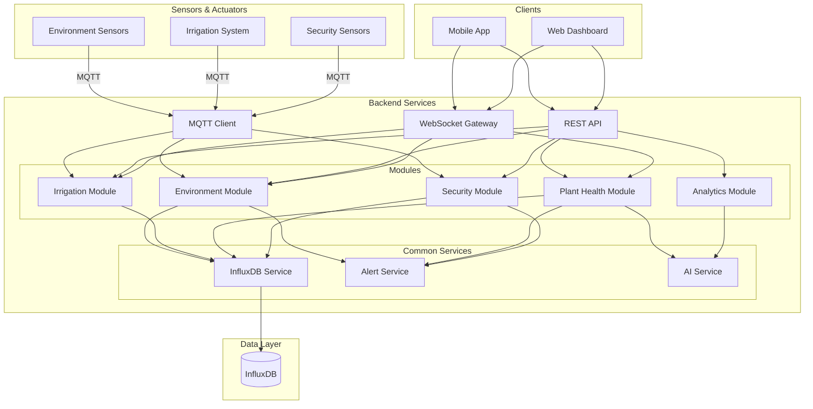

# Design Document

## Overview

The Haunted Greenhouse system is a comprehensive IoT monitoring and control platform built on NestJS with TypeScript. The system integrates real-time sensor data collection, automated control systems, AI-based analysis, and predictive analytics to enable intelligent greenhouse management. The architecture follows a modular design with clear separation of concerns between data collection, storage, analysis, and presentation layers.

The system leverages InfluxDB2 for time-series data storage, MQTT for sensor communication, WebSocket for real-time updates, and REST APIs for control operations. The design emphasizes reliability, performance, and extensibility to support future enhancements.

## Architecture

### High-Level Architecture



### Module Responsibilities

**EnvironmentModule**: Collects and stores environmental sensor data, triggers threshold-based alerts, provides historical data queries.

**IrrigationModule**: Manages manual and automated irrigation control, monitors water resources, logs irrigation events.

**PlantHealthModule**: Processes plant images, performs disease detection, tracks growth metrics, generates treatment recommendations.

**AnalyticsModule**: Generates environmental predictions, produces optimization recommendations, integrates external weather data.

**SecurityModule**: Monitors physical security sensors, triggers security alerts, maintains security event logs.

**Common Services**: Shared services for InfluxDB access, alert management, and AI model integration.

## Components and Interfaces

### AnalyticsModule (New)

The AnalyticsModule is responsible for predictive analytics and optimization recommendations. It analyzes historical data to forecast future conditions and suggest operational improvements.

#### AnalyticsService

```typescript
interface PredictionResult {
  metric: string;
  predictions: Array<{
    timestamp: Date;
    value: number;
    confidenceInterval: {
      lower: number;
      upper: number;
    };
  }>;
  generatedAt: Date;
  dataPointsUsed: number;
}

interface OptimizationRecommendation {
  id: string;
  category: 'temperature' | 'humidity' | 'light' | 'irrigation' | 'general';
  title: string;
  description: string;
  expectedImpact: string;
  priority: 'low' | 'medium' | 'high';
  actionItems: string[];
  generatedAt: Date;
}

interface WeatherData {
  timestamp: Date;
  temperature: number;
  humidity: number;
  precipitation: number;
  solarRadiation: number;
  source: string;
}

class AnalyticsService {
  async generatePredictions(
    metrics: string[],
    hoursAhead: number
  ): Promise<PredictionResult[]>;
  
  async generateOptimizationRecommendations(): Promise<OptimizationRecommendation[]>;
  
  async fetchWeatherData(): Promise<WeatherData[]>;
  
  async getHistoricalData(
    metric: string,
    startDate: Date,
    endDate: Date
  ): Promise<Array<{ timestamp: Date; value: number }>>;
}
```

#### PredictionEngine

The PredictionEngine implements time-series forecasting using statistical methods.

```typescript
interface TimeSeriesPoint {
  timestamp: Date;
  value: number;
}

interface ForecastConfig {
  method: 'moving_average' | 'exponential_smoothing' | 'linear_regression';
  confidenceLevel: number; // 0.0 to 1.0
}

class PredictionEngine {
  forecast(
    historicalData: TimeSeriesPoint[],
    hoursAhead: number,
    config: ForecastConfig
  ): PredictionResult;
  
  calculateConfidenceInterval(
    predictions: number[],
    historicalData: TimeSeriesPoint[],
    confidenceLevel: number
  ): Array<{ lower: number; upper: number }>;
}
```

#### OptimizationEngine

The OptimizationEngine analyzes data patterns to generate actionable recommendations.

```typescript
interface AnalysisContext {
  environmentalData: TimeSeriesPoint[];
  plantHealthData: any[];
  growthMetrics: any[];
  weatherForecast: WeatherData[];
}

class OptimizationEngine {
  analyzeEnvironmentalConditions(
    context: AnalysisContext
  ): OptimizationRecommendation[];
  
  identifyIrrigationOptimizations(
    soilMoistureData: TimeSeriesPoint[],
    waterUsage: number[]
  ): OptimizationRecommendation[];
  
  assessEnergyEfficiency(
    lightingData: TimeSeriesPoint[],
    temperatureData: TimeSeriesPoint[]
  ): OptimizationRecommendation[];
}
```

#### WeatherIntegrationService

Fetches and caches external weather data.

```typescript
interface WeatherApiConfig {
  apiUrl: string;
  apiKey: string;
  location: {
    latitude: number;
    longitude: number;
  };
}

class WeatherIntegrationService {
  async fetchForecast(): Promise<WeatherData[]>;
  
  async getCachedWeather(): Promise<WeatherData[]>;
  
  isWeatherDataStale(): boolean;
}
```

#### AnalyticsController

```typescript
@Controller('analytics')
class AnalyticsController {
  @Get('predictions')
  async getPredictions(
    @Query('metrics') metrics: string[],
    @Query('hours') hours: number
  ): Promise<PredictionResult[]>;
  
  @Get('recommendations')
  async getRecommendations(): Promise<OptimizationRecommendation[]>;
  
  @Get('weather')
  async getWeatherForecast(): Promise<WeatherData[]>;
}
```

### Enhanced AlertService

The existing AlertService will be extended to support predictive alerts.

```typescript
interface PredictiveAlert extends Alert {
  type: 'predictive_threshold_breach';
  predictedTime: Date;
  predictedValue: number;
  threshold: number;
  metric: string;
}

class AlertService {
  // Existing methods...
  
  async sendPredictiveAlert(
    metric: string,
    predictedValue: number,
    predictedTime: Date,
    threshold: number
  ): Promise<PredictiveAlert>;
}
```

## Data Models

### Prediction Data Model

```typescript
interface Prediction {
  id: string;
  metric: string;
  timestamp: Date;
  predictedValue: number;
  confidenceLower: number;
  confidenceUpper: number;
  generatedAt: Date;
  modelVersion: string;
}
```

### Recommendation Data Model

```typescript
interface Recommendation {
  id: string;
  category: string;
  title: string;
  description: string;
  expectedImpact: string;
  priority: string;
  actionItems: string[];
  generatedAt: Date;
  status: 'active' | 'implemented' | 'dismissed';
}
```

### Weather Data Model

```typescript
interface Weather {
  timestamp: Date;
  temperature: number;
  humidity: number;
  precipitation: number;
  solarRadiation: number;
  windSpeed: number;
  cloudCover: number;
  source: string;
  fetchedAt: Date;
}
```

### InfluxDB Schema

**Predictions Measurement**:
- Measurement: `predictions`
- Tags: `metric`, `model_version`
- Fields: `predicted_value`, `confidence_lower`, `confidence_upper`
- Timestamp: prediction target time

**Recommendations Measurement**:
- Measurement: `recommendations`
- Tags: `category`, `priority`, `status`
- Fields: `title`, `description`, `expected_impact`
- Timestamp: generation time

**Weather Measurement**:
- Measurement: `weather_forecast`
- Tags: `source`
- Fields: `temperature`, `humidity`, `precipitation`, `solar_radiation`, `wind_speed`, `cloud_cover`
- Timestamp: forecast time


## Correctness Properties

*A property is a characteristic or behavior that should hold true across all valid executions of a system—essentially, a formal statement about what the system should do. Properties serve as the bridge between human-readable specifications and machine-verifiable correctness guarantees.*

### Property Reflection

After analyzing all acceptance criteria, several properties can be consolidated to eliminate redundancy:

- Properties 2.1 and 2.2 (high/low temperature alerts) can be combined into a single threshold breach property
- Properties 4.4 and 4.5 (reservoir validation) test the same validation logic and can be combined
- Properties 5.1 and 5.2 (automated irrigation start/stop) can be combined into a single automated control property
- Alert content completeness properties (2.4, 9.3, 15.2) follow the same pattern and can be generalized

The following properties represent the unique, non-redundant correctness guarantees:

### Data Collection and Storage Properties

**Property 1: Sensor data persistence with timestamps**
*For any* sensor reading collected by the EnvironmentModule, when stored to InfluxDB, the data SHALL include a timestamp accurate to the second, sensor type, value, unit, and location metadata.
**Validates: Requirements 1.1, 1.3**

**Property 2: Current data freshness**
*For any* request for current sensor readings, all returned data SHALL have timestamps within the last 60 seconds of the request time.
**Validates: Requirements 1.2**

**Property 3: Historical data query accuracy**
*For any* time range query for historical data, all returned records SHALL have timestamps within the requested range, and no records within the range SHALL be omitted.
**Validates: Requirements 3.1**

**Property 4: Query filtering correctness**
*For any* historical data query with filters for sensor type, time range, or location, all returned records SHALL match all specified filter criteria.
**Validates: Requirements 3.3**

### Alert System Properties

**Property 5: Threshold breach alert triggering**
*For any* environmental sensor reading that exceeds a configured threshold (high or low), the System SHALL trigger an alert with the correct alert type.
**Validates: Requirements 2.1, 2.2**

**Property 6: Alert content completeness**
*For any* alert triggered by the System, the alert SHALL include all required fields: sensor type (or event type), current value, threshold value (if applicable), timestamp, and location.
**Validates: Requirements 2.4, 9.3, 15.2, 17.1**

**Property 7: Custom threshold override**
*For any* sensor with a custom threshold configured, when a reading exceeds the custom threshold, the System SHALL trigger an alert; when a reading exceeds only the default threshold but not the custom threshold, no alert SHALL be triggered.
**Validates: Requirements 2.5**

**Property 8: Alert delivery to configured channels**
*For any* alert triggered by the System, the alert SHALL be sent through all configured alert channels (email, in-app, push, webhook).
**Validates: Requirements 2.3, 9.4, 15.4**

### Irrigation Control Properties

**Property 9: Manual irrigation command execution**
*For any* valid start or stop irrigation command from an operator, the System SHALL change the irrigation state accordingly and log the event with timestamp, operator identifier, and action type.
**Validates: Requirements 4.1, 4.2, 4.3**

**Property 10: Reservoir level validation**
*For any* start irrigation command, if the reservoir level is below 10 percent, the System SHALL reject the command and return an error message; if the reservoir level is at or above 10 percent, the System SHALL accept the command.
**Validates: Requirements 4.4, 4.5**

**Property 11: Automated irrigation control**
*For any* soil moisture reading, if automation is enabled and soil moisture falls below the lower threshold, the System SHALL start irrigation; if soil moisture reaches the upper threshold, the System SHALL stop irrigation; if automation is disabled, no automatic actions SHALL occur regardless of soil moisture levels.
**Validates: Requirements 5.1, 5.2, 5.4**

**Property 12: Automated irrigation event logging**
*For any* automated irrigation action, the System SHALL log the event with timestamp, trigger condition, and soil moisture value.
**Validates: Requirements 5.3**

**Property 13: Flow rate validation and adjustment**
*For any* flow rate adjustment command, if the requested rate is within the supported hardware range, the System SHALL apply the new rate and log the change with timestamp, previous rate, new rate, and operator identifier; if the rate is outside the supported range, the System SHALL reject the command.
**Validates: Requirements 6.1, 6.2, 6.3**

**Property 14: Water usage calculation**
*For any* irrigation event with known flow rate and duration, the calculated water usage SHALL equal the flow rate multiplied by the duration.
**Validates: Requirements 7.3**

**Property 15: Water usage aggregation**
*For any* water usage query with aggregation by day, week, or month, the total usage for each period SHALL equal the sum of all irrigation events within that period.
**Validates: Requirements 7.4**

### Plant Health Properties

**Property 16: Image upload validation**
*For any* uploaded file, if the file format is JPEG, PNG, or WebP and the file size is less than 10 megabytes, the System SHALL accept the upload; otherwise, the System SHALL reject the upload with an appropriate error message.
**Validates: Requirements 8.1, 8.2**

**Property 17: Image metadata completeness**
*For any* accepted plant image, the stored image SHALL include metadata with upload timestamp, operator identifier, and plant location.
**Validates: Requirements 8.3**

**Property 18: Disease detection output format**
*For any* plant image analyzed by the PlantHealthModule, the analysis result SHALL include disease name (or "healthy"), confidence score, and affected area information.
**Validates: Requirements 9.1**

**Property 19: Disease alert threshold**
*For any* disease detection result, if the confidence score is above 70 percent, the System SHALL trigger a disease alert; if the confidence score is 70 percent or below, no alert SHALL be triggered.
**Validates: Requirements 9.2**

**Property 20: Growth metrics calculation**
*For any* sequence of plant images for the same plant, the System SHALL calculate growth metrics including height change, leaf area change, and overall size change, and store the metrics with timestamp and plant identifier.
**Validates: Requirements 10.1, 10.2, 10.3**

**Property 21: Growth data aggregation**
*For any* growth data query with aggregation by plant and time period, all metrics for the same plant within the same period SHALL be grouped together.
**Validates: Requirements 10.4**

**Property 22: Treatment recommendation generation**
*For any* detected disease, the System SHALL generate treatment recommendations that include specific actions, required materials, application timing, and priority ordering by effectiveness and ease of implementation.
**Validates: Requirements 11.1, 11.2, 11.3**

**Property 23: Treatment recommendation association**
*For any* disease alert, when an operator views the alert, the System SHALL return the treatment recommendations associated with the detected disease.
**Validates: Requirements 11.4**

### Analytics and Prediction Properties

**Property 24: Prediction data window**
*For any* prediction generation request, the System SHALL analyze environmental data from the last 30 days prior to the generation time.
**Validates: Requirements 12.1**

**Property 25: Prediction metric coverage**
*For any* prediction generation request, the System SHALL generate predictions for temperature_air, humidity_air, and light_intensity for the next 24 hours.
**Validates: Requirements 12.2**

**Property 26: Prediction confidence intervals**
*For any* generated prediction, the prediction result SHALL include confidence intervals or uncertainty estimates for each predicted value.
**Validates: Requirements 12.4**

**Property 27: Predictive alert generation**
*For any* prediction where the predicted value exceeds a configured alert threshold, the System SHALL generate a proactive alert indicating the predicted breach.
**Validates: Requirements 12.5**

**Property 28: Optimization recommendation data sources**
*For any* optimization recommendation generation, the System SHALL analyze environmental data, plant health data, and growth metrics from all available sources.
**Validates: Requirements 13.1**

**Property 29: Optimization recommendation content**
*For any* generated optimization recommendation, the recommendation SHALL include specific adjustments to temperature, humidity, light, or irrigation schedules, and SHALL include expected impact on plant growth or health.
**Validates: Requirements 13.2, 13.3**

**Property 30: Weather data storage completeness**
*For any* weather data retrieved from the external API, the stored data SHALL include temperature, humidity, precipitation, and solar radiation forecasts with timestamps.
**Validates: Requirements 14.2**

**Property 31: Weather data integration in predictions**
*For any* prediction generation when weather data is available, the prediction model SHALL incorporate the external weather data; when weather data is unavailable, the prediction model SHALL use only internal historical data.
**Validates: Requirements 14.3, 14.4**

### Security Properties

**Property 32: Motion detection alert triggering**
*For any* motion detection event, if off-hours monitoring is configured and the current time is within the specified monitoring period, the System SHALL trigger a motion alert; if the current time is outside the monitoring period, no alert SHALL be triggered; if off-hours monitoring is not configured, the System SHALL always trigger an alert.
**Validates: Requirements 15.1, 15.3**

**Property 33: Access point state monitoring**
*For any* door or window sensor, the System SHALL report the current state as either "open" or "closed", and when the state changes, the System SHALL log the event with timestamp and location.
**Validates: Requirements 16.1, 16.3**

**Property 34: Access point status query completeness**
*For any* request for access point status, the System SHALL return the current state of all monitored doors and windows.
**Validates: Requirements 16.4**

**Property 35: Security log filtering**
*For any* security log query with filters for event type, time range, or location, all returned events SHALL match all specified filter criteria and SHALL be ordered in reverse chronological order.
**Validates: Requirements 17.3, 17.4**

### System Reliability Properties

**Property 36: Sensor failure tolerance**
*For any* sensor that fails to report data, the System SHALL log the failure and continue collecting data from all other functioning sensors without interruption.
**Validates: Requirements 18.4**

**Property 37: API authentication enforcement**
*For any* API endpoint except health check endpoints, requests without valid authentication SHALL be rejected with an appropriate error response.
**Validates: Requirements 19.1**

**Property 38: Account lockout after failed authentication**
*For any* account, after three consecutive failed authentication attempts, the System SHALL temporarily lock the account for 15 minutes and reject all authentication attempts during the lockout period.
**Validates: Requirements 19.4**

## Error Handling

### Error Categories

**Validation Errors**: Input validation failures (invalid file formats, out-of-range values, missing required fields)
- HTTP Status: 400 Bad Request
- Response includes specific validation error messages

**Authentication/Authorization Errors**: Failed authentication, insufficient permissions
- HTTP Status: 401 Unauthorized or 403 Forbidden
- Response includes generic error message (no sensitive information)

**Resource Not Found Errors**: Requested resource doesn't exist
- HTTP Status: 404 Not Found
- Response includes resource type and identifier

**External Service Errors**: InfluxDB connection failures, weather API unavailable, AI service errors
- HTTP Status: 503 Service Unavailable
- System logs detailed error, response includes generic message
- Implement retry logic with exponential backoff

**Internal Server Errors**: Unexpected errors, unhandled exceptions
- HTTP Status: 500 Internal Server Error
- System logs full error details with stack trace
- Response includes generic error message and request ID for tracking

### Error Handling Strategies

**Graceful Degradation**: When external services are unavailable, the system continues operating with reduced functionality (e.g., predictions without weather data).

**Circuit Breaker Pattern**: After repeated failures to external services, temporarily stop attempting requests to prevent cascading failures.

**Retry Logic**: Transient failures to InfluxDB or external APIs are retried with exponential backoff (max 3 attempts).

**Error Logging**: All errors are logged with context (request ID, user ID, timestamp, error details) for debugging and monitoring.

**User-Friendly Messages**: Error responses to clients include actionable messages without exposing internal system details.

## Testing Strategy

### Unit Testing

Unit tests will verify individual components and functions in isolation using Jest. Focus areas include:

**Service Logic**: Test business logic in services (validation, calculations, data transformations)
- AnalyticsService prediction generation logic
- OptimizationEngine recommendation generation
- IrrigationService validation logic
- AlertService alert creation and filtering

**Data Transformations**: Test DTOs, mappers, and data formatting functions
- Prediction result formatting
- Weather data transformation
- Alert message formatting

**Edge Cases**: Test boundary conditions and error cases
- Empty data sets for predictions
- Invalid threshold configurations
- Missing required fields

**Integration Points**: Test service interactions with mocked dependencies
- AnalyticsService with mocked InfluxDbService
- WeatherIntegrationService with mocked HTTP client

### Property-Based Testing

Property-based tests will verify universal properties across many randomly generated inputs using fast-check (JavaScript property-based testing library). Each property-based test will run a minimum of 100 iterations.

**Configuration**: 
```typescript
import * as fc from 'fast-check';

// Example configuration
fc.assert(
  fc.property(
    fc.record({
      // generators here
    }),
    (input) => {
      // property test here
    }
  ),
  { numRuns: 100 }
);
```

**Property Test Requirements**:
- Each property-based test MUST be tagged with a comment referencing the correctness property from this design document
- Tag format: `// Feature: haunted-greenhouse, Property {number}: {property_text}`
- Each correctness property MUST be implemented by a SINGLE property-based test
- Tests MUST use the fast-check library, not implement property-based testing from scratch

**Test Organization**:
- Property tests will be co-located with unit tests in `.spec.ts` files
- Each module will have property tests for its core correctness properties
- Property tests will focus on data integrity, validation logic, and calculation correctness

### Integration Testing

Integration tests will verify end-to-end workflows using the NestJS testing module with real dependencies where practical:

**API Endpoints**: Test complete request/response cycles
- POST /analytics/predictions with various parameters
- GET /analytics/recommendations
- POST /irrigation/start with validation

**Database Integration**: Test InfluxDB read/write operations
- Storing and querying predictions
- Time-range queries with filtering
- Data aggregation queries

**Module Integration**: Test interactions between modules
- AnalyticsModule triggering alerts via AlertService
- IrrigationModule reading sensor data from EnvironmentModule

### Test Coverage Goals

- Unit test coverage: >80% for service logic
- Property-based tests: All 38 correctness properties implemented
- Integration tests: All critical user workflows covered
- Edge case coverage: All validation and error handling paths tested

## Implementation Notes

### Prediction Algorithm Selection

For the initial implementation, use **exponential smoothing** for time-series forecasting:
- Simple to implement and understand
- Works well with regular time-series data
- Provides reasonable accuracy for short-term forecasts (24 hours)
- Can be enhanced later with more sophisticated models (ARIMA, LSTM)

### Weather API Integration

Recommended weather API: **OpenWeatherMap** or **Weather.gov API**
- Free tier available for development
- Provides all required forecast data
- Reliable uptime and documentation
- Easy integration with REST API

### Caching Strategy

**Predictions**: Cache for 6 hours (matches update frequency)
**Weather Data**: Cache for 1 hour (matches fetch frequency)
**Recommendations**: Cache for 24 hours (updated weekly, but cache shorter for responsiveness)

### Performance Considerations

**Prediction Generation**: Run asynchronously to avoid blocking API requests
**Data Queries**: Use InfluxDB aggregation functions to reduce data transfer
**Caching**: Implement Redis caching for frequently accessed data (future enhancement)

### Scalability Considerations

**Horizontal Scaling**: Design services to be stateless for easy horizontal scaling
**Database Partitioning**: Use InfluxDB retention policies to manage data growth
**Async Processing**: Use job queues (Bull/BullMQ) for long-running tasks like prediction generation (future enhancement)
